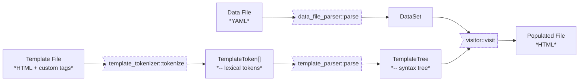

[](https://sonarcloud.io/project/overview?id=dusan-rychnovsky_yet-another-site-generator)
[](https://sonarcloud.io/project/overview?id=dusan-rychnovsky_yet-another-site-generator)
[](https://sonarcloud.io/project/overview?id=dusan-rychnovsky_yet-another-site-generator)
[](https://sonarcloud.io/project/overview?id=dusan-rychnovsky_yet-another-site-generator)
[](https://sonarcloud.io/project/overview?id=dusan-rychnovsky_yet-another-site-generator)  

# YASG - Yet Another (Static) Site Generator

A generator of static HTML pages. Compiles a given HTML template- and a given YAML data-file to an HTML page with populated content.

Runs in two modes:

* **Single-File mode**:  
  Takes a single template- and a single data-file and prints the result to standard output.
* **Recursive mode**:  
  Takes a source- and a destination-directory. Traverses the source-directory recursively, processes
  each data-file (i.e. `*.yml`) found and generates populated HTML files in the destination-directory,
  while mirroring directory structure.
  In recursive mode, each data-file contains a root-level `template` field, which specifies the path to its corresponding template-file.

See examples below.

## High-level Architecture

The following diagram shows how a `Data File` and `Template File` are loaded and parsed, and then combined into a `Populated File`:



## How To

### Build

```
$ git clone https://github.com/dusan-rychnovsky/yet-another-site-generator.git
$ cd yet-another-site-generator
$ cargo test
$ cargo build --release
```

### Run

```
// single-file mode
$ ./target/release/yasg [DATA-FILE] [TEMPLATE-FILE] > output.html

// recursive mode
$ ./target/release/yasg -r [SRC-DIR] [DEST-DIR]
```

## Examples

### Example #1: Generating a single file

This simple example ilustrates how to process a single data-file.

**Step #1:**  
Create files `example-template.html` and `example-data.yml` with following contents:

**example-template.html:**
```html
<html>
  <head>
    <title>[title]</title>
  </head>
  <body>
    <h1>[title]</h1>
    <p>This is a testing page.</p>
    [IF EXISTS backpack.items]
      <h2>Items in Backpack:</h2>
      <ul>
      [FOR item IN backpack.items]
        <li>[item.name] - weight: [item.weight]</li>
      [ENDFOR item]
      </ul>
    [ENDIF]
  </body>
</html>
```

**example-data.yml:**
```yml
title: Hello World!
backpack:
  items:
    - name: sleeping *bag*
      weight: '1.5kg'
    - name: tent
      weight: '2.0kg'
    - name: water *bottle*
      weight: '0.5kg'
```

**Step #2:**  
Execute YASG:

```
./yasg example-data.yml example-template.html > output.html
```

**Step #3:**  
The result will be:

**output.html:**
```html
<html>
  <head>
    <title>Hello World!</title>
  </head>
  <body>
    <h1>Hello World!</h1>
    <p>This is a testing page.</p>
    <h2>Items in Backpack:</h2>
    <ul>
      <li>sleeping <em>bag</em> - weight: 1.5kg</li>
      <li>tent - weight: 2.0kg</li>
      <li>water <em>bottle</em> - weight: 0.5kg</li>
    </ul>
  </body>
</html>
```

### Example #2: Recursively processing a directory

This example ilustrates how to process all data-files in a given directory, using a single YASG execution.

**Step #1:**  
Create the following file structure:

```
📁 src/
├── 📁 main/
│   └── 📁 stews/
│       └── 📄 beef-stew.yml
├── 📁 salads/
│   └── 📄 shopska-salad.yml
└── 📄 template.html
📁 dst/
```

Note that, at this point, the `dst` directory is empty.

The files have the following contents:

**template.html:**
```html
<html>
  <head>
    <title>Recept na: [title]</title>
  </head>
  <body>
    <h1>Recept na: [title]</h1>
    <h2>Suroviny:</h2>
    <ul>
    [FOR ingredient IN ingredients]
      <li>[ingredient]</li>
    [ENDFOR ingredient]
    </ul>
    <h2>Příprava:</h2>
    <ul>
    [FOR step IN instructions]
      <li>[step]</li>
    [ENDFOR step]
    </ul>
  </body>
</html>
```

**beef-stew.yml:**
```yml
template: ../../template.html
title: Dušené hovězí
ingredients:
  - 1 kg hovězího masa (např. kližka)
  - 2 velké cibule
  - 3 mrkve
  - 2 brambory
  - 3 stroužky česneku
  - 1 l vývaru (hovězí nebo zeleninový)
  - 2 lžíce rajčatového protlaku
  - 2 bobkové listy
  - sůl a pepř podle chuti
  - olej na smažení
instructions:
  - Na pánvi rozehřejte olej a osmahněte na něm nakrájenou cibuli dozlatova.
  - Přidejte nakrájené hovězí maso a opékejte, dokud nezhnědne ze všech stran.
  - ...
```

**shopska-salad.yml:**
```yml
template: ../template.html
title: Šopský salát
ingredients:
  - 1 okurka
  - 2 rajčata
  - 1 červená paprika
  - 1 červená cibule
  - 200 g sýra feta
  - 50 ml olivového oleje
  - sůl a pepř podle chuti
instructions:
  - Nakrájejte okurku, rajčata, papriku a červenou cibuli na kostičky.
  - V míse smíchejte nakrájenou zeleninu.
  - ...
```

**Step #2:**  
Execute YASG:

```
./yasg -r ./src ./dst
```

**Step #3:**  
As a result, `beef-stew.html` and `shopska-salad.html` files will be generated in `dst` directory, mirroring sub-directory structure of `src`.

```
📁 src/
├── 📁 main/
│   └── 📁 stews/
│       └── 📄 beef-stew.yml
├── 📁 salads/
│   └── 📄 shopska-salad.yml
└── 📄 template.html
📁 dst/
├── 📁 main/
│   └── 📁 stews/
│       └── 📄 beef-stew.html
└── 📁 salads/
    └── 📄 shopska-salad.html
```

The generated files should have following contents:

**beef-stew.html:**
```html
<html>
  <head>
    <title>Recept na: Dušené hovězí</title>
  </head>
  <body>
    <h1>Recept na: Dušené hovězí</h1>
    <h2>Suroviny:</h2>
    <ul>
      <li>1 kg hovězího masa (např. kližka)</li>    
      <li>2 velké cibule</li>    
      <li>3 mrkve</li>    
      <li>2 brambory</li>    
      <li>3 stroužky česneku</li>    
      <li>1 l vývaru (hovězí nebo zeleninový)</li>    
      <li>2 lžíce rajčatového protlaku</li>    
      <li>2 bobkové listy</li>    
      <li>sůl a pepř podle chuti</li>    
      <li>olej na smažení</li>    
    </ul>
    <h2>Příprava:</h2>
    <ul>    
      <li>Na pánvi rozehřejte olej a osmahněte na něm nakrájenou cibuli dozlatova.</li>    
      <li>Přidejte nakrájené hovězí maso a opékejte, dokud nezhnědne ze všech stran.</li>    
      <li>...</li>    
    </ul>
  </body>
</html>
```

**shopska-salad.html:**
```html
<html>
  <head>
    <title>Recept na: Šopský salát</title>
  </head>
  <body>
    <h1>Recept na: Šopský salát</h1>
    <h2>Suroviny:</h2>
    <ul>    
      <li>1 okurka</li>    
      <li>2 rajčata</li>    
      <li>1 červená paprika</li>    
      <li>1 červená cibule</li>    
      <li>200 g sýra feta</li>    
      <li>50 ml olivového oleje</li>    
      <li>sůl a pepř podle chuti</li>    
    </ul>
    <h2>Příprava:</h2>
    <ul>    
      <li>Nakrájejte okurku, rajčata, papriku a červenou cibuli na kostičky.</li>    
      <li>V míse smíchejte nakrájenou zeleninu.</li>    
      <li>...</li>    
    </ul>
  </body>
</html>
```

